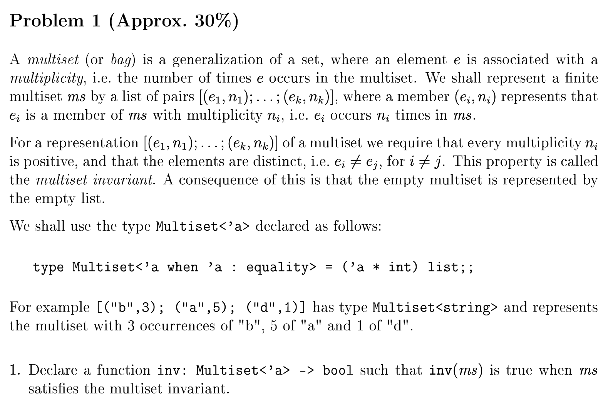
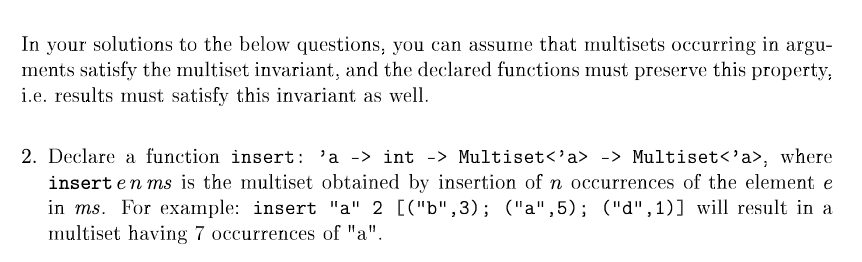
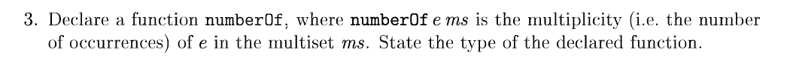
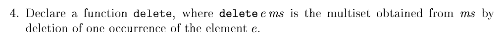
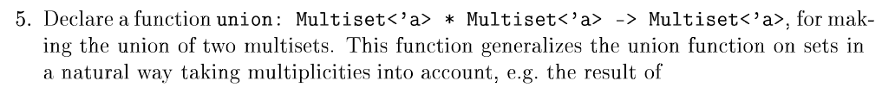
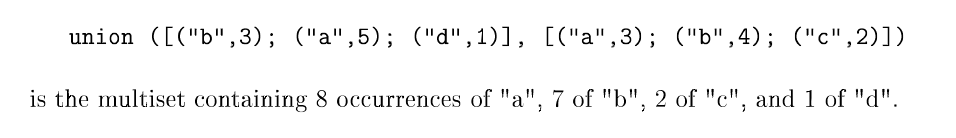
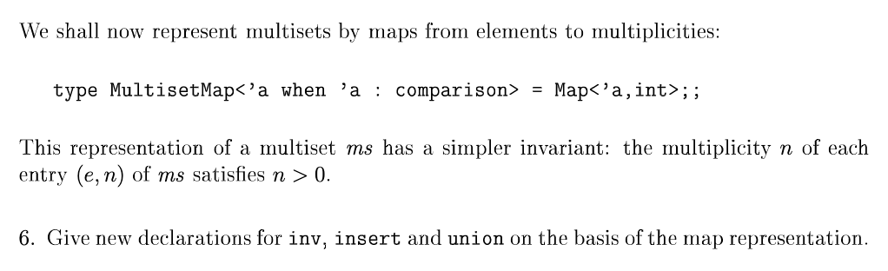

```fsharp
type Multiset<'a when 'a: equality> = ('a * int) list 
```

```fsharp
let rec inv ms =
    match ms with
    | [] -> true
    | (key, _) :: tail ->
        (List.fold (fun acc (k, _) -> if k = key then acc + 1 else acc) 0 ms) = 1
        && inv tail

```



```fsharp
let rec insert e n ms =
    match ms with
    | [] -> []
    | head :: tail ->
        let (k, v) = head
        if k = e then (k, v + n) :: insert e n tail 
        else head :: insert e n tail
```



```fsharp
let rec numberOf e = function
    | [] -> failwith ("Der var ingen " + e + " i multitsættet")
    | (k, v) :: _ when k = e -> v
    | _ :: tail -> numberOf e tail
```



```fsharp
let rec delete e ms =
    match ms with
    | [] -> []
    | head :: tail ->
        let (k, v) = head
        if k = e then delete e tail else head :: delete e tail
```



```fsharp
let rec union ms1 ms2 =
    match ms1, ms2 with
    | [], [] -> []
    | ms1', [] -> ms1' @ ms2
    | [], ms2' -> ms2'
    | (k, v) :: tail, ms2' -> union tail (insert k v ms2')
```




```fsharp
type MultisetMap<'a when 'a: comparison> = Map<'a, int>
```

I og med at key'en er skal være unik i et map vil inv være unødventig da den automatisk er opfyldt.

```fsharp
let insertMap e n ms =
    match Map.tryFind e ms with
    | Some (v) -> Map.remove e ms |> Map.add e (v + n)
    | None -> Map.add e n ms
```

```fsharp

```