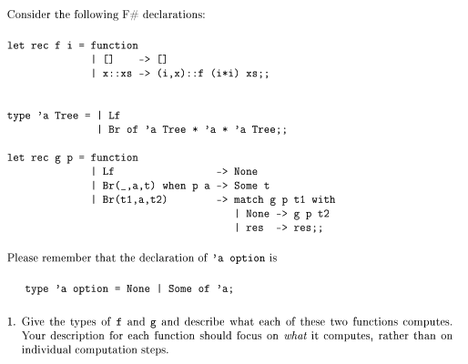
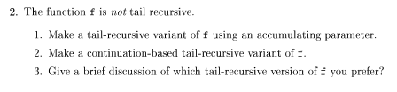
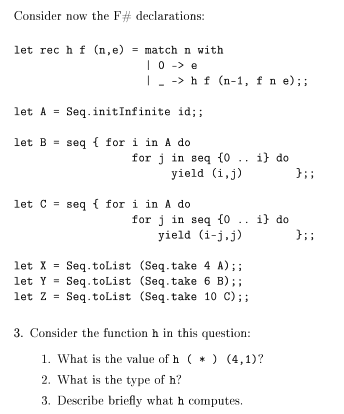
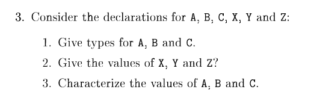

## Problem 2 (30%)



    f
    i = int 
    "arg" = 'a list 
    output = (int * 'a) list  

    g
    p = ('a -> bool)
    "arg" = 'a Tree
    output = 'a Tree option

f producere en liste med tuples bestående af i som vokser kvadradisk og elementet af input listen

g producere et tree og retunere den forgræning i en option hvor grænens rod-element opfylder predicatet *p* ellers retuneres None




```fsharp
let f i l =
    let rec loop acc i = function
        | [] -> List.rev acc
        | x::xs -> loop ((i,x)::acc) (i*i) xs
    loop [] i l
```

```fsharp
let f i l =
    let rec loop cont i = function
        | [] -> cont []
        | x::xs -> loop (fun acc -> cont ((i,x)::acc)) (i*i) xs
    loop id i l
```

jeg ville helst bruge den udgave som blot er tail-recursive da den er lettere at forstå.



##### 1. vil give 24

##### 2. 
    f = (int -> int -> int)
    "tuple" = (int * int)

    (int -> 'a -> 'a) -> (int * 'a) -> 'a

##### 3. 
    n antal transoformationer på e

##### 3 



###### types

1. A  seq<int>
2. B seq<int * int>
3. C seq<int * int>

###### computes:

    A = [0; 1; 2; 3]
    B = [(0, 0); (1, 0); (1, 1); (2, 0); (2, 1); (2, 2)]
    C = [(0, 0); (1, 0); (0,1); (2,0); (3, 0); (2, 1); (1, 2); (0, 3)]

