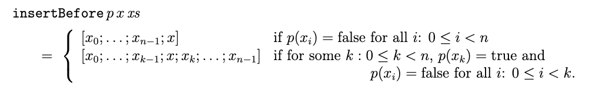

## Problem 2 (Approx. 30%)

In the following two questions we are interested in deciding two properties (called *ordered* and *smallerThanAll*) in connection with integer lists:

- ordered *xs* is true if xs is aweakly ascending list, that is *x0 ≤ x1 ≤ x2 ≤ ··· ≤ xn−1* when xs = [x0;x1;x2;... xn−1].

- *smallerThanAll x xs* is true if *x* is smaller than every element of the list xs.

##### 1. Make an F# declaration for the function *ordered*. What is the (most general) type of the declared function?

```fsharp
let rec ordered ol =
    let rec aux predecessor =
        function
        | [] -> true
        | head :: tail when head >= predecessor -> aux head tail && true
        | head :: tail -> aux head tail && false

    aux -999999 ol
```

###### Type

    int list -> bool

##### 2. Make an F# declaration for the function *smallerThanAll*. What is the (most general) type of the declared function?

```fsharp
let smallerThanAll x xs = List.forall (fun i -> x < i ) xs
```

###### Type

    'a -> 'a list -> bool

    Kan fx ikke afgøre om det er en "float list" eller en "int list" derfor 'a list.

Consider now the following insertion function on lists:

    insertBefore: (’a -> bool) -> ’a -> ’a list -> ’a list

where *insertBefore p x xs* inserts *x* in *xs* just before the first element *xk* of *xs* satisfying p(i.e.p(xk) = true). Let xs = [x0;. . .;xn−1] in the following more formal definition:



##### 3. Give an F# declaration for *insertBefore*.

```fsharp
let rec insertBefore p x = function
    | [] -> []
    | head::tail -> if p head then x :: head :: tail
                    else head :: insertBefore p x tail
```

##### 4. Consider the following type for the sex of a person: 

```fsharp
type Sex = | M              // male
           | F              // female
```

Declare a function *sexToString: Sex -> string*, where the string representation of *M* is "Male" and the string representation of *F* is "Female".

```fsharp
let sexToString = function
    | M -> "Male"
    | F -> "Female"
```

##### 5. Declare a function *replicate* with the type int -> string -> string. The value of *replicate n str* is the string obtained by concatenating *n* copies of *str*. The function should raise an exception when the integer argumentnis negative. For example, *replicate 3* "abc" = "abcabcabc" and *replicate 0* "abc"="".

```fsharp
let replicate n str =

    let rec loop acc n = 
        match n with 
        | n when n < 0 -> failwith "n can't be negative!"
        | 0 -> acc
        | n -> loop (str + acc) (n-1)
    
    loop "" n
```