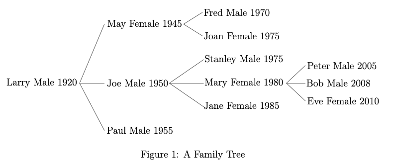

## Problem 3 (40%)

We shall now consider family trees, also called trees of descendants, which give an overview of the descendants of a person, called the ancestor, in the form of a tree. The list of children of a person form the basis for the trees of descendants of that person. Information about persons, such as name,sex and year of birth, occurs in the nodes of the trees.



A family tree is shown in Figure 1, where the name of the ancestor is Larry, a male personborn in 1920. The children of Larry are May, Joe and Paul. Larry has five grandchildren

— one is Mary and she has three children.

Family trees are represented in F# as follows:

```fsharp
type Name = string
type Sex = | M              // male
           | F              // female

type YearOfBirth = int

type FamilyTree = P of Name * Sex * YearOfBirth * Children
and Children = FamilyTree list
```

The type for the sex is as in Problem 2. From now on we assume that the name of a person is unique in a family tree and that two persons in a family tree do not share children.

For F# representations of family trees we shall consider two properties:

1. Every person must be older than his/her children.

2. For every list of children, the siblings occur with decreasing ages so that the eldest occurs first and the youngest last.

A family tree satisfying these two properties is called well-formed.

##### 1. Declare a function *isWF: FamilyTree -> bool* that can check whether a family tree is well-formed.

 // contains n head || triSearch n tail

```fsharp
let rec isWFchildren lastCBith pb = function
    | [] -> true
    | child :: rest ->
        let (P (_, _, yofb, c)) = child
        pb < yofb
        && lastCBith < yofb
        && isWF child
        && isWFchildren yofb pb rest

and isWF = function
    | P (n, s, yofb, c) -> isWFchildren 0 yofb c
```

In the following questions you can assume that an argument (of type FamilyTree or typeChildren) to a function is well-formed. Furthermore, it is expected that the functions produce well-formed values (when they are of type FamilyTreeor type Children).

##### 2. Declare a function makePerson: Name*Sex*YearOfBith -> FamilyTree that can create a family tree for a child-less person on the basis of the name, sex and year of birth.

```fsharp
let makePerson (n, s, yofb) = P(n, s, yofb, [])
```

##### 3. Declare two mutually recursive functions:

    insertChildOf: Name -> FamilyTree -> FamilyTree -> FamilyTree option
    
    insertChildOfInList: Name -> FamilyTree -> Children -> Children option

The value of insertChildOf n c t = Some t′ when t′ is the family tree obtained from t by insertion of c as a child of the person with namen. 

The value is *None* if such an insertion is not possible (i.e. would create a tree that is not well-formed). Similarly, the value of insertChildOfInList n c cs = Some cs′ when cs′ is the list of children obtained from cs by inserting c as a child of a person named n in one of the children in cs. The valueisNone if such an insertion is not possible. Note that the person named n may occur anywhere in the family tree.

```fsharp
let rec insertChildOf n c t =
    match t with
    | P (name, s, yofb, cs) when name = n -> Some(P(n, s, yofb, insertInOrder c cs))
    | P (n, s, yofb, cs) ->
        match insertChildOfInList n c cs with
        | None -> None
        | Some cs' -> Some(P(n, s, yofb, cs'))

and insertChildOfInList n c cs =
    match cs with
    | [] -> None
    | c :: cs ->
        match insertChildOf n c c with
        | None ->
            match insertChildOfInList n c cs with
            | None -> None
            | Some cs' -> Some(c :: cs')
        | Some c' -> Some(c' :: cs)

and insertInOrder c cs =
    match cs with
    | [] -> []
    | curP :: tail ->
        let (P (_, _, pyofb, cs)) = c
        let (P (_, _, cyofb, cs)) = curP
        if cyofb < pyofb then curP :: (insertInOrder c tail) else c :: curP :: tail
```

##### 4. Declare a function find so that find n t extracts information about the person named n in the family treet. This information comprises the sex, year of birth and the namesof all children of that person.

Family trees are sometimes presented using an indentation scheme where each person inthe tree occurs on a separate line and where the next generation is indented a specificnumber of positions. For example, the presentation of the family tree in Figure 1 is:

    Larry Male 1920
        May Female 1945F
            red Male 1970
            Joan Female 1975
        Joe Male 1950
            Stanley Male 1975
            Mary Female 1980
                Peter Male 2005
                Bob Male 2008
                Eve Female 2010
            Jane Female 1985
        Paul Male 1955

Using six blank characters as indentation between generation. The ancestor, that is Larry,appears at the first line. His eldest child May appears six positions indented at the secondline. Her eldest child appears twelve positions indented at the third line and her second(and youngest) child appears twelve positions indented at the fourth line, and so on.