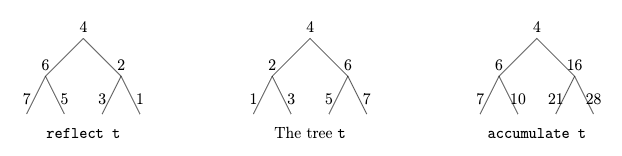

## Problem 3 (30%)

Consider the following F# declarations of a type for binary trees and a binary tree *t*:

```fsharp
type Tree<'a> = Lf | Br of Tree<'a> * 'a * Tree<'a>

let t = Br(Br(Br(Lf,1,Lf),2,Br(Lf,3,Lf)),4,Br(Br(Lf,5,Lf),6,Br(Lf,7,Lf)))
```



An illustration of the tree *t* is given in the middle part of the above figure. The left part of the figure shows the reflection of *t*, that is, a mirror image of *t* formed by exchanging the left and right subtrees all the way down.

##### 1. Declare a function *reflect* that can reflect a tree as described above.

```fsharp
let rec reflect = function
    | Lf -> Lf
    | Br(a, b) :: taill ->  Br(b, a)
```

The right part of the figure shows a tree obtained from *t* by accumulating the values in the nodes of *t* as they are visited through a pre-order traversal. For example, the values in thenodes of *t* are visited in the sequence: 4, 2, 1, 3, 6, 5, 7. Hence, the node of accummulate *t* corresponding to the node of *t* with value 3, has value 10 = 4+2+1+3.

##### 2. Declare a function *accumulate* that can accumulate the values in a tree as described above. Hint: You may declare an auxiliary function having an accumulating parameter.

```fsharp
let accumulate t = 
    let rec loop acc = function
        | Lf -> Lf
        | Br(a, v, b) -> 
                        Let nodeValue = acc + v
                        Br(loop nodeValue a, nodeValue, loop nodeValue b)

```

Consider now the following declarations:


```fsharp
let rec k i t =
    match t with
    | Lf -> Lf
    | Br (tl, a, tr) -> Br(k (i * i) tl, i * a, k (i * i) tr)

let rec h n m =
    function
    | Br (tl, a, tr) when n = m -> h n 1 tl @ [ a ] @ h n 1 tr
    | Br (tl, _, tr) -> h n (m + 1) tl @ h n (m + 1) tr
    | Lf -> []

let q n t = h n n t
```

##### 3. Give the most general types of *k* and *q* and describe what each of these two functions computes. Your description for each function should focus on what it computes, rather than on individual computation steps.

##### Funktion: k

###### Types

    i = int
    t = Tree<int> 
    output = Tree<int> 

    Resultat:
    int -> Tree<int> -> Tree<int> 

###### Description

    k functionen retunere et træ hvor der er blevet ganget i*i*i for hver dybte i træet.

###### Funktion: h 

    n = int
    m = int
    "function arg" = Tree<'a> 
    output = 'a list

    int -> int -> Tree<'a> -> 'a list

###### Description

```fsharp
(* todo *)
```